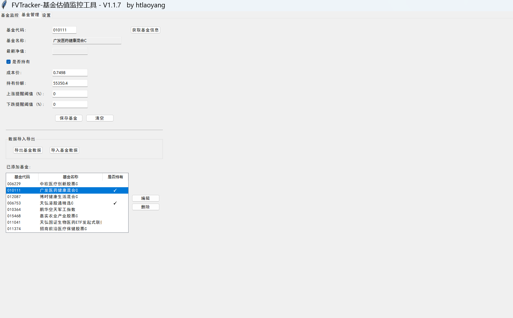
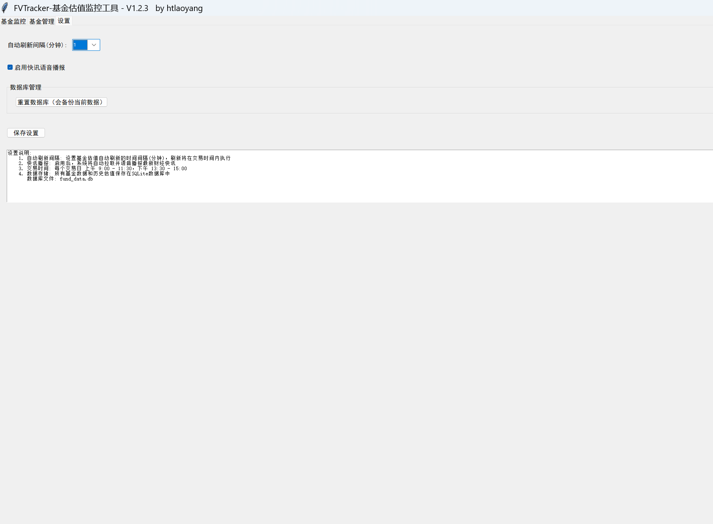
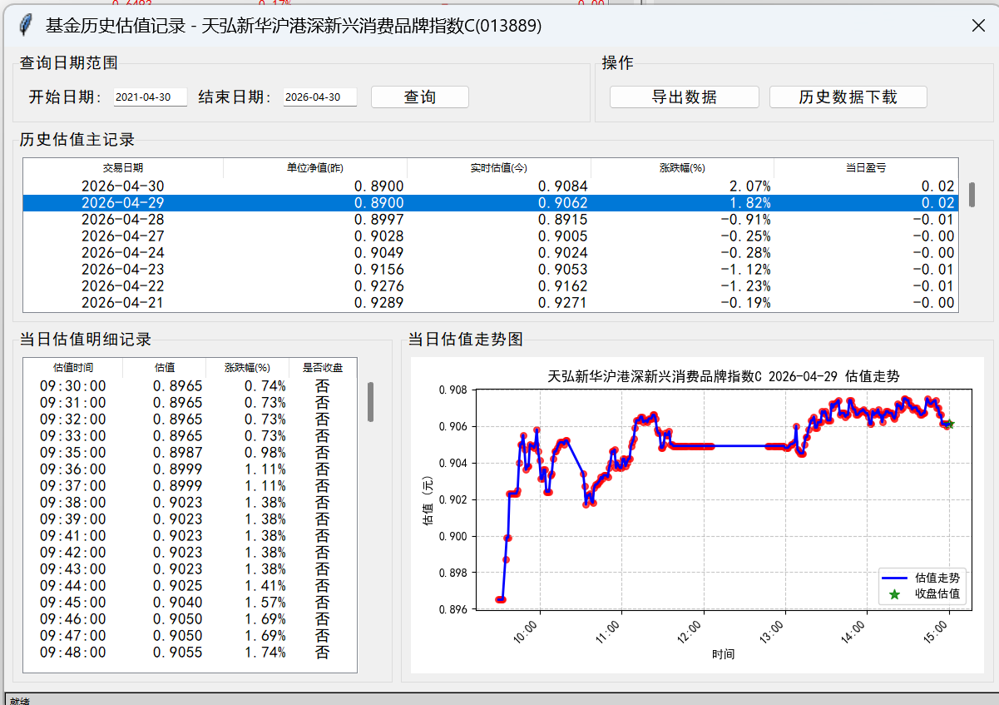
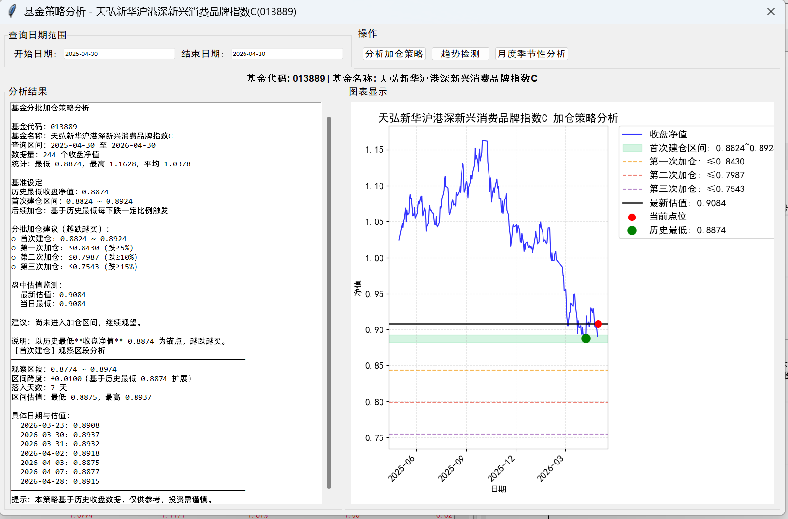

<div align="center">
  
  <h1>FVTracker</h1>
</div>

<div style="height: 10px; clear: both;"></div>

<div align="center">
  <p>基于Python的基金估值跟踪工具。</p>
  <p>
    <a href="https://gitee.com/HTLaoYang/FVTracker" target="_blank"></a>
    <a href="https://gitee.com/HTLaoYang/FVTracker" target="_blank"></a>
    <a href="https://github.com/htlaoyang/FVTracker" target="_blank"></a>
    <a href="https://github.com/htlaoyang/FVTracker" target="_blank"></a>
    <a href="https://www.python.org/" target="_blank"></a>
        <a href="./LICENSE" target="_blank"></a>
  </p>
</div>


## 📋 项目概述

FVTracker 是一个基于Python的基金估值跟踪工具，接口数据来源于网上公开的API；
项目初衷主要是获取基金每天实时估值记录，用于分析及提供一些特定策略。
对于估值在底部震荡基金，提出一个分批加仓策略建议;帮助用户证验自已的操作理念或是提供回本执行计划；
仅供学习参考，投资需谨慎。
项目地址：[gitee](https://gitee.com/HTLaoYang/FVTracker)    |    [github](https://github.com/htlaoyang/FVTracker) 


## 🛠️ 技术栈

### 
- **开发语言**：Python 3.8.10
- **GUI库*****：Tkinter
- **包管理器**：pip 25.0.1

## 🏗️ 项目结构

```
root
├── utils                          # 工具
│   ├── db                         # 数据库
│      ├── database.py             # 数据库操作
│      └── db_upgrade_manager.py   # 数据库升级
│   ├── logger.py                  # 日志
│   └── stock_index_fetcher        # 指数
│   └── sys_chinese_font.py        # 字体
│   └── message_notifier.py        # 消息框
├── module                         # 功能模块
│   ├── fund_manager.py            # 基金管理模块
│   ├── fund_history_viewer.py     # 基金历史净值查询及分析模块
│   ├── FVTracker.py               # 基金监控跟踪模块
├── main.py                        # 程序入口
├── config.py                      # 常量配置
├── build_exe.py                   # 打包入口
├── FVTracker.ico                  # 国标
```

## 🚀 环境要求与安装

### 环境要求建议
- Python >= 3.8.10
- pip    >= 25.0.1 
- Git

### 使用步骤及说明

1. 克隆仓库
```bash
git clone git clone https://github.com/htlaoyang/FVTracker.git
cd FVTracker
```

2. 安装依赖
```bash
pip install -r requirements.txt
```

3. 运行
```bash
python main.py
```

4. 构建EXE执行文件
```bash
python build_exe.py
```


## 💎 功能

### 业务功能
- **基金管理****：基金信息的维护
- **设置管理****：监控的配置
- **基金监控****：基金实时净值获取、指数实时净值获取、基金历史估值查询、基金左侧加仓策略建议
- **数据库升级**：数据库自动升级

## 📸 功能截图

### 监控主界面

### 基金管理

### 设置

### 基金历史净值查询

### 基金左侧加仓策略分析



## 📄 许可证

[MIT License](./LICENSE)


## 📮 联系方式

- **作者**: HTLaoYang
- **邮箱**: htlaoyang@163.com
- **作者主页**: https://gitee.com/HTLaoYang

## 👏 微信交流群/合作
**加群前请先阅读一下内容：**
- 禁止内容：黄腔、暴力言论、政治话题，违者直接飞机票（踢出群）
- 问题请在群内讨论
<table>
  <tr>
    <td align="center">官方公众号</td>
  </tr>
  <tr>
    <td ></td>  
  </tr>
</table>
 

## 🧧 捐献作者
### 都划到这了，如果我的项目对您有帮助，请赞助我吧！😊😊😊
<table>
  <tr>
    <td align="center">支付宝</td>
    <td align="center">微信</td>
  </tr>
  <tr>
    <td ></td>  
    <td ></td>  
  </tr>
</table>

## ⭐ Star History
[](https://www.star-history.com/#HTLaoYang/FVTracker&Date)
                       